# The Return of Attention - Complete System Flowchart

## Overview
This comprehensive flowchart represents the complete user journey and system flow for "The Return of Attention" meditation web application.

---

## 1. AUTHENTICATION & ONBOARDING FLOW

```mermaid
flowchart TD
    A[Start] --> B{User Type?}
    
    %% New User Registration
    B -->|New User| C[Choose Registration Method]
    C --> D{Registration Type?}
    D -->|Manual| E[Manual Signup Form]
    D -->|Google| F[Google OAuth]
    
    %% Manual Registration
    E --> G[Enter Email, Password, Name]
    G --> H[Submit Registration]
    H --> I[Account Created]
    I --> J[Send Email Verification]
    J --> K[Check Email Status]
    K -->|Not Verified| L[Show Verification Notice]
    K -->|Verified| M[Personal Info Form]
    
    %% Google Registration
    F --> N[Google Authentication]
    N --> O[Account Created with Google]
    O --> M
    
    %% Personal Information
    M --> P[Enter Age, Gender, Nationality, Country]
    P --> Q[Submit Personal Info]
    Q --> R[Check Assessment Status]
    
    %% Existing User Login
    B -->|Existing User| S[Choose Login Method]
    S --> T{Login Type?}
    T -->|Manual| U[Enter Email & Password]
    T -->|Google| V[Google OAuth Login]
    U --> W[Validate Credentials]
    W -->|Valid| X[Login Successful]
    W -->|Invalid| Y[Show Error Message]
    Y --> U
    V --> X
    
    %% Forgot Password
    U --> Z[Forgot Password?]
    Z -->|Yes| AA[Enter Email for Reset]
    AA --> BB[Send Reset Email]
    BB --> CC[Click Reset Link]
    CC --> DD[Enter New Password]
    DD --> EE[Password Reset Success]
    EE --> U
    
    %% Post-Login Assessment Check
    X --> R
    R --> FF[Check Completion Status]
    FF --> GG{Questionnaire Complete?}
    GG -->|No| HH[Show Questionnaire Notice]
    HH --> II[Start Questionnaire]
    GG -->|Yes| JJ{Self-Assessment Complete?}
    JJ -->|No| KK[Show Self-Assessment Notice]
    KK --> LL[Start Self-Assessment]
    JJ -->|Yes| MM[Redirect to Dashboard]
    
    %% Initial Assessments - Questionnaire
    I
	
	OO[Experience Level & Goals]
    OO --> PP[Age Range & Location]
    PP --> QQ[Occupation & Education Level]
    QQ --> RR[Meditation Background]
    RR --> SS[Sleep Pattern & Physical Activity]
    SS --> TT[Stress Triggers & Daily Routine]
    TT --> UU[Diet Pattern & Screen Time]
    UU --> VV[Social Connections & Work Life Balance]
    VV --> WW[Emotional Awareness & Stress Response]
    WW --> XX[Decision Making & Self Reflection]
    XX --> YY[Thought Patterns & Mindfulness in Daily Life]
    YY --> ZZ[Mindfulness Experience & Meditation Background Detail]
    ZZ --> AAA[Practice Goals & Preferred Duration]
    AAA --> BBB[Biggest Challenges & Motivation]
    BBB --> CCC[Submit Questionnaire]
    CCC
	
    LL
	MM
    
    %% Initial Self-Assessment (from notice or questionnaire completion)
    LL --> EEE[Initial Self-Assessment]
    EEE --> FFF[Food Taste Assessment]
    FFF --> GGG[Scents & Aromas Assessment]
    GGG --> HHH[Sounds & Music Assessment]
    HHH --> III[Visual & Beauty Assessment]
    III --> JJJ[Touch & Textures Assessment]
    JJJ --> KKK[Thoughts & Mental Images Assessment]
    KKK --> LLL[Submit Self-Assessment]
    LLL --> MMM[Calculate Initial Happiness Score]
    MMM --> MM
	II --- OO
	KK
	CCC --- JJ
```

---

